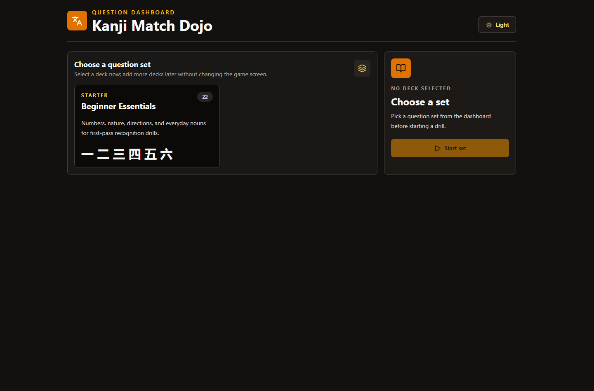

# Kanji Match Dojo

Kanji Match Dojo is a focused React matching game for practicing beginner kanji recognition. It starts from a deck dashboard, then drills the selected question set by matching each kanji to its English meaning.



## Live App

https://kanji-matcher-challenge.vercel.app

## Features

- Deck dashboard for selecting the active question set.
- One built-in starter deck with 22 beginner kanji.
- Future-ready question set structure for adding more decks.
- Exam-style matching with no reading hints on active prompts or answers.
- Correct pairs disappear from both columns.
- Match count, miss count, accuracy, timer, and per-deck best time.
- Light and dark mode with a matching splash screen on every reload.
- Fully client-side React app with no required environment variables.

## Tech Stack

- React 19
- TypeScript
- Vite
- Tailwind CSS
- Motion
- Lucide React

## Getting Started

Install dependencies:

```bash
npm install
```

Run the development server:

```bash
npm run dev
```

Open:

```text
http://localhost:3000/
```

## Build

```bash
npm run build
```

The production build is written to `dist/`.

## Progress Storage

Best times are stored in the browser with `localStorage`, keyed by question-set id. That keeps each deck's best time available after reloads on the same browser and device. It is not a cloud account system, so best times do not sync across browsers or devices.

## Scripts

| Command | Description |
| --- | --- |
| `npm run dev` | Start the Vite development server on port 3000. |
| `npm run build` | Create a production build. |
| `npm run preview` | Preview the production build locally. |
| `npm run lint` | Run TypeScript checks. |
| `npm run clean` | Remove `dist`. |

## Adding More Question Sets

Question sets live in `src/App.tsx` inside `QUESTION_SETS`. Add another object with a unique `id`, display metadata, and an `items` array shaped like this:

```ts
{
  id: 23,
  kanji: '中',
  meaning: 'Middle',
  reading: 'naka'
}
```

The dashboard and matcher will pick it up automatically.
